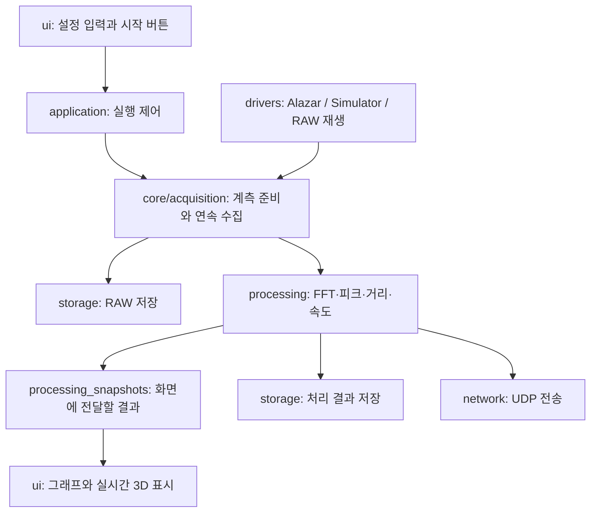

# 기본 FMCW LiDAR 소스 이해하기

**대상: `FMCW_LiDAR` 기본 제품 · 기준일: 2026-09-22 소스 정리 이후**

이 문서는 폴더 이름만 봐서는 무엇을 하는지 알기 어려운 사람을 위한 안내입니다.
전체 구조를 먼저 이해한 뒤, 필요한 기능의 파일을 찾아 읽을 수 있도록 구성했습니다.
파일 하나하나의 위치와 역할은 [전체 파일 목록](source_file_index_ko.md)에서 찾을 수 있습니다.

## 읽는 순서

1. [전체 구조](#overview): 프로그램을 이루는 부분들
2. [실행 흐름](#flow): 실행부터 측정·저장까지
3. [파일 이름과 외부 도구](#terms): `.h`, `.cpp`, CUDA, FFTW, Alazar 구분
4. [폴더와 파일 설명](#folders): 기능별 상세 안내
5. [수정할 파일 찾기](#changes): 실제 작업 예시
6. [MCU 펌웨어](#firmware): 보드 안에서 실행되는 코드
7. [테스트와 보관 코드](#tests): 기본 앱 소스와의 관계

<a id="overview"></a>
## 1. 전체 구조

이 프로젝트는 **측정 데이터를 받아 거리·속도를 계산하고, 화면에 표시하거나 파일로 저장하는 프로그램**입니다.
여러 폴더는 이 일을 나누어 맡고 있습니다.

| 폴더 | 쉬운 설명 | 대표적인 일 |
|---|---|---|
| `src/apps/` | 프로그램을 처음 시작하는 곳 | Windows 또는 Jetson에서 창 띄우기 |
| `src/application/` | 여러 기능의 실행 순서를 연결하는 곳 | 시작·정지, 장치 연결, 처리·저장 연결 |
| `src/ui/` | 사람이 보는 화면 | 버튼, 설정 입력, 그래프, 3D 점군 |
| `src/core/` | 여러 기능이 함께 사용하는 기반 | 설정, 계측 세션, 데이터 모양, 상태, 로그 |
| `src/drivers/` | 실제 장치나 입력과 연결하는 곳 | Alazar, MCU, EDFA, RAW 재생, 시뮬레이터 |
| `src/processing/` | 측정값을 계산하는 곳 | FFT, 피크 탐색, 거리·속도·좌표 계산 |
| `src/storage/` | 파일을 읽고 쓰는 곳 | RAW 저장·읽기, 처리 결과 저장, 설정 이력 |
| `src/network/` | 다른 프로그램으로 보내는 곳 | UDP 점군 전송 |
| `src/firmware/` | MCU 보드 안에서 실행하는 별도 프로그램 | 파형 수신, 타이머에 맞춘 DAC·미러 제어 |

`src/` 밖에도 역할이 나뉘어 있습니다.

| 위치 | 내용 |
|---|---|
| `config/` | 실행할 때 읽는 설정값·보정값·MCU 파형 파일 |
| `tests/` | 코드가 예상대로 동작하는지 확인하는 테스트 |
| `deploy/` | 빌드 결과를 Windows/Jetson 배포본으로 묶는 스크립트 |
| `build/` | 컴파일 중간 파일, 실행 파일, 패키지와 검증 기록 |
| `data/`, `outputs/` | 측정 데이터와 실행 결과 |
| `docs/` | 사용법·설계·개발 설명서 |
| `legacy/` | 비교하거나 참고하기 위해 보존한 과거 코드 |
| `Ros_project/` | 전송된 데이터를 ROS에서 수신하고 표시하는 보조 프로젝트 |

`src/core/config/`는 **설정을 처리하는 코드**, 루트의 `config/`는 **그 코드가 읽는 설정 데이터**입니다.

<a id="flow"></a>
## 2. 프로그램은 어떤 순서로 움직이나요?

### 프로그램을 열 때

```text
apps/windows/main.cpp 또는 apps/jetson/main.cpp
  → Qt 프로그램 준비
  → ui/main_window.cpp에서 화면 구성
  → application/application_controller.cpp와 화면 연결
  → 사용자 입력을 기다림
```

`main.cpp`는 시작점입니다. 화면 전체나 FFT 계산을 이 파일 하나에 작성한 것은 아닙니다.
Windows와 Jetson은 시작 파일이 따로 있지만, 화면·계측·처리의 대부분은 같은 소스를 사용합니다.

### 측정 또는 RAW 재생을 시작할 때

아래 그림은 코드의 역할을 이해하기 위한 흐름도입니다. 실제 함수 호출과 스레드의 모든 세부 순서를 표시한 것은 아닙니다.



예를 들어 **그래프 색상을 바꾸는 일**은 `ui`, **거리 계산 방법을 바꾸는 일**은 `processing`,
**계측 보드와 연결하는 방법을 바꾸는 일**은 `drivers/alazar`에서 시작합니다.

<a id="terms"></a>
## 3. 파일 이름과 도구를 먼저 구분하기

### 확장자는 무엇인가요?

| 이름 | 의미 | 이 프로젝트의 예 |
|---|---|---|
| `.h` | 다른 파일이 사용할 자료형·함수·클래스의 선언. 짧은 구현이 함께 있을 수도 있음 | `main_window.h` |
| `.cpp` | C++로 작성한 실제 동작 | `main_window.cpp` |
| `.cu` | CUDA로 컴파일하는 GPU 관련 구현 | `cuda_fft_backend.cu` |
| `.c` | C로 작성한 구현. 이 프로젝트에서는 주로 MCU 코드 | MCU의 `main.c` |
| `.s` | MCU가 시작할 때 실행할 어셈블리 코드 | `startup_stm32h750vbtx.s` |
| `CMakeLists.txt` | 어떤 파일을 어떤 라이브러리와 함께 빌드할지 지정 | `src/CMakeLists.txt` |
| `.md` | 설명서 | 이 문서와 `src/README.md` |
| `.ioc` | STM32CubeMX의 핀·클록·주변장치 설정 | `FMCW_LiDAR_MCU.ioc` |
| `.ld` | MCU 코드와 데이터를 Flash/RAM 어디에 배치할지 지정 | `STM32H750VBTX_FLASH.ld` |

같은 이름의 `.h`와 `.cpp`는 서로 다른 기능 두 개가 아니라 **하나의 기능에 대한 선언과 구현**인 경우가 많습니다.
`point_cloud_camera.h`처럼 헤더에 구현까지 있는 파일도 있어 모든 `.h`에 `.cpp`가 필요한 것은 아닙니다.

### CUDA·FFTW·Alazar와 우리가 만든 코드

| 구분 | 외부에서 제공하는 것 | 프로젝트에서 작성한 연결 코드 |
|---|---|---|
| Alazar | 계측 보드와 ATS-SDK | `drivers/alazar/alazar_digitizer.*` |
| FFTW | CPU FFT 라이브러리 | `processing/cpu/fftw_backend.cpp` |
| CUDA / cuFFT | GPU 개발 도구와 GPU FFT 라이브러리 | `processing/cuda/*.cu` |
| Qt | 창·버튼·그래프 표시 등에 사용하는 GUI 라이브러리 | `ui/`, `application/` |

`alazar_digitizer.cpp`는 ATS-SDK 자체의 원본이 아니라 **우리 프로그램이 SDK를 호출하도록 연결하는 코드**입니다.
마찬가지로 `fftw_backend.cpp`는 FFTW 라이브러리 자체를 새로 만든 파일이 아닙니다.

VS Code의 `Basic Windows Release (Alazar + CUDA + FFTW)` 메뉴는
[CMakePresets.json](../../CMakePresets.json)에 등록한 **빌드 설정 묶음**입니다.
“Alazar 수집 기능, CPU FFT 기능, GPU FFT 기능을 포함해서 프로그램을 만들자”라는 뜻입니다.
Windows C++ 부분은 MSVC, CUDA 소스는 CUDA 컴파일러 `nvcc`를 사용하는 구성입니다.

**빌드할 때 기능을 포함하는 것**과 **실행 중 어떤 기능을 사용할지 고르는 것**은 구분합니다.
예를 들어 세 기능을 모두 포함한 실행 파일에서 입력은 Simulator, FFT 처리는 FFTW를 선택할 수 있습니다.
Alazar는 데이터를 받는 역할이고 FFTW/cuFFT는 계산하는 역할이므로 같은 프로그램에 함께 들어갈 수 있습니다.

### 자주 나오는 말

| 용어 | 여기서의 뜻 |
|---|---|
| Driver / Adapter | 공통 프로그램과 실제 장치·SDK 사이를 연결하는 코드 |
| Backend | 같은 계산을 수행하는 구체적인 구현. 예: CPU FFTW, GPU cuFFT |
| Interface | 구현이 달라도 같은 방식으로 호출하기 위한 공통 약속 |
| Worker / Thread | 화면과 별도로 계속 수행되는 수집·처리 등의 작업 |
| Queue | 수집한 데이터를 처리·저장 차례가 올 때까지 보관하는 대기열 |
| Frame / Batch | 데이터 단위 / 여러 레코드를 묶어서 전달하는 단위. 정확한 모양은 `frame_types.h`에 정의 |
| Snapshot | 화면이나 다른 작업이 읽을 수 있도록 전달하는 시점별 결과 |
| Protocol | 송신자와 수신자가 약속한 명령·데이터 형식 |
| Stub | 기능을 빌드하지 않았을 때 사용 불가 상태를 반환하는 대체 구현 |

<a id="folders"></a>
## 4. 폴더와 주요 파일 설명

아래 표의 `이름.h / 이름.cpp`는 같은 폴더 안에 있는 두 파일을 의미합니다.
각 파일로 바로 이동하려면 [전체 파일 목록](source_file_index_ko.md)을 사용하세요.

### `src/apps/` — 시작점

| 파일 | 역할 |
|---|---|
| `windows/main.cpp` | Windows Qt 앱을 시작하고 창을 생성. smoke test·스크린샷 등의 명령행 옵션 처리 |
| `jetson/main.cpp` | Jetson Qt 앱을 시작하고 창을 생성. Jetson 실행 진입점 |

PCD 파일 열기 옵션은 기본 제품에서 거부합니다. 시작 파일은 플랫폼별로 존재하지만 기본 기능은 공통 코드를 사용합니다.

### `src/application/` — 프로그램 실행 제어C:\Users\user\Desktop\Cad\BFCT_Fiber_tray

| 파일 | 역할 |
|---|---|
| `application_controller.h / .cpp` | 화면에서 받은 요청을 RuntimeWorker에 전달하고, 장치·계측·처리·저장의 연결과 실행·정지를 조정. 상태·로그·결과를 화면으로 전달 |
| `replay_setup_loader.h / .cpp` | 저장한 RAW와 함께 기록된 설정을 찾아 복원. 재생 파일 경로가 변경됐는지도 판단 |

“시작 버튼은 눌렸는데 수집이나 저장이 시작되지 않는다”면 이 폴더와 `core/acquisition`을 함께 확인합니다.

### `src/ui/` — 화면

| 파일 | 역할 |
|---|---|
| `main_window.h / .cpp` | 전체 창, 페이지, 버튼, 입력칸, 상태 표시를 구성. 입력값을 설정에 반영하고 controller와 연결 |
| `plots/plot_widgets.h / .cpp` | 선 그래프, B-scan heatmap, up/down 구간 표시 위젯. 축·범위·그리기와 화면 갱신 통계 처리 |
| `point_cloud/point_cloud_widget.h / .cpp` | 점군을 화면에 그리는 3D 위젯. OpenGL 표시와 대체 표시 경로, 사용자 조작 처리 |
| `point_cloud/point_cloud_camera.h` | 3D 화면의 시점·회전·이동·확대 등에 사용하는 카메라 계산 |
| `point_cloud/point_cloud_grid.h` | 화면 배율과 독립적인 미터 격자 좌표·표시 범위 계산 |

여기의 “3D 점군 표시”는 **실시간 FMCW 계산 결과 표시**에도 필요합니다. PCD 파일 재생 기능과 동일한 뜻이 아닙니다.

### `src/core/acquisition/` — 계측 실행과 데이터 수집

| 파일 | 역할 |
|---|---|
| `acquisition_session.h / .cpp` | digitizer·MCU·EDFA를 한 계측 세션으로 관리. 연결, 설정, 준비, 트리거, 수집, 정상·비상 정지 |
| `continuous_acquisition_worker.h / .cpp` | 별도 작업에서 데이터를 반복해서 받아 다음 처리 단계에 전달. 중단 요청과 수집 종료 상태 관리 |
| `raw_frame_batch_pool.h / .cpp` | 여러 RAW 레코드를 담을 버퍼를 재사용하도록 관리. 반복적인 메모리 할당 부담을 줄임 |

장치가 데이터를 내주는 구체적인 방식은 `drivers`, 여러 장치를 함께 시작·정지하는 흐름은 이 폴더가 맡습니다.

### `src/core/config/` — 설정을 읽고 검증

| 파일 | 역할 |
|---|---|
| `config_types.h / .cpp` | `SystemConfig`와 계측·처리·저장 등의 설정 자료형. enum과 문자열 사이의 변환 |
| `config_document.h / .cpp` | 프로젝트에서 사용하는 YAML 설정을 파싱하고 항목을 조회·병합·직렬화 |
| `config_profile.h / .cpp` | 설정 문서와 `SystemConfig`를 변환. 여러 설정 파일의 순차 적용, 프로필 저장, 설정 스냅샷 생성 |
| `config_validation.h / .cpp` | 범위와 조합이 가능한 설정인지 검증하고 오류·경고를 반환 |
| `config_policy.h / .cpp` | 초기 설계의 설정 항목별 변경 정책표. 현재 GUI 명령의 실제 허용·전환 동작은 `application`의 RuntimeWorker를 함께 확인 |

새 설정을 추가한다면 자료형만 추가하는 것으로 끝나지 않습니다. 읽기·저장·검증·화면 연결도 함께 살펴야 합니다.

### `src/core/runtime/` — 상태와 중단 관리

| 파일 | 역할 |
|---|---|
| `system_state.h / .cpp` | 프로그램 동작 상태와 허용되는 상태 전환을 표현 |
| `cancellation.h` | 오래 걸리는 작업에 “취소 요청이 왔는가”를 전달·확인하는 공통 함수 형식 |
| `stop_result.h` | 정지 과정의 단계별 오류를 모으고 전체 성공 여부와 요약을 반환 |
| `realtime_thread.h / .cpp` | 처리 스레드·프로세스의 우선순위 설정을 돕는 플랫폼별 코드. 시간 내 처리 성공을 보증하는 것은 아님 |
| `system_telemetry.h` | 계측 상태와 수집 통계 등을 전달할 공통 스냅샷 자료형 |

### `src/core/devices/` — 장치의 공통 약속

| 파일 | 역할 |
|---|---|
| `device_interfaces.h` | `IDigitizer`, `IMcuController`, `IEdfaController` 등의 공통 인터페이스와 장치 상태·파형 자료형 |
| `digitizer_capabilities.h / .cpp` | 계측 보드별 지원 사양과 샘플링 속도·레코드 길이·입력 범위 등의 지원 여부 판단 |

공통 인터페이스가 있기 때문에 실제 보드, 가짜 보드, RAW 재생 입력을 비슷한 방식으로 다룰 수 있습니다.

### `src/core/types/` — 데이터 모양과 스캔 좌표

| 파일 | 역할 |
|---|---|
| `frame_types.h` | 샘플 버퍼, RAW 프레임, DMA 배치, 스캔 위치, 피크, 처리 결과, XYZ 점 자료형 |
| `scan_trajectory.h / .cpp` | 레코드·스캔 위치 관계를 계산하고 생성된 raster 위치 또는 RAW 재생 위치를 정렬 |

여기의 자료형은 수집·처리·저장·전송에서 함께 쓰므로 필드를 바꿀 때 사용하는 부분들도 확인해야 합니다.

### `src/core/diagnostics/` — 로그와 버전

| 파일 | 역할 |
|---|---|
| `logging.h / .cpp` | 로그 심각도, 항목, 메모리 로그 저장과 시간·문자열 표시 |
| `app_version.h / .cpp` | 앱 버전 정보와 표시용 버전 문자열 |

### `src/drivers/` — 장치와 입력 연결

| 하위 폴더 / 파일 | 역할 |
|---|---|
| `runtime_adapter_factory.h / .cpp` | 입력 종류에 따라 Alazar·Simulator·RAW 재생 digitizer를 선택. MCU·EDFA는 별도 프로필 모드를 따르는 serial controller로 연결 |
| `alazar/alazar_digitizer.h / .cpp` | ATS-SDK로 보드 검색·설정·준비·수집·정지 수행, 수집 데이터를 공통 인터페이스로 전달 |
| `alazar/alazar_sample_conversion.h / .cpp` | Alazar의 left-aligned ADC 샘플을 signed 16-bit 표현으로 변환 |
| `serial/serial_transport.h / .cpp` | Windows COM 또는 Linux tty 열기·읽기·쓰기·정리, 사용 가능한 포트 조회 |
| `mcu/mcu_protocol.h / .cpp` | 파형 구성·기존 XYM 파형 읽기, MCU 명령 문자열 생성과 ACK/오류 응답 해석 |
| `mcu/mcu_serial_controller.h / .cpp` | 시리얼로 MCU에 파형 업로드·시작·정지 명령 전달, 응답·진행 상태 처리 |
| `edfa/edfa_protocol.h / .cpp` | EDFA 명령 바이트 생성과 상태·출력·활성화 응답 해석 |
| `edfa/edfa_serial_controller.h / .cpp` | EDFA 연결과 명령 왕복, 출력 설정·상태 관리 |
| `replay/replay_digitizer.h / .cpp` | 저장된 RAW 데이터를 읽어 실제 digitizer와 같은 입력 인터페이스로 공급 |
| `simulator/fake_digitizer.h / .cpp` | 장비 없이 사용할 모의 측정 데이터 생성 |
| `simulator/fake_mcu.h / .cpp` | MCU 연결·파형·상태를 모의 구현 |
| `simulator/fake_edfa.h / .cpp` | EDFA 제어와 상태를 모의 구현 |

`protocol`은 **어떤 내용의 명령을 주고받는지**, `serial_controller`는 **실제로 보내고 응답을 기다리는 절차**,
`serial_transport`는 **운영체제의 시리얼 포트를 다루는 일**을 맡습니다.

### `src/processing/` — 계산

| 파일 | 역할 |
|---|---|
| `signal_processor.h / .cpp` | RAW 구간 전처리·window 적용·FFT·피크 탐색을 연결하고 거리·속도·좌표 계산. GPU 배치 처리 경로와도 연결 |
| `processing_service.h / .cpp` | 처리 대기열과 worker 관리, 설정 변경 반영, 처리 지연·통계, 결과 callback 전달 |
| `processing_snapshots.h / .cpp` | 시간 파형·FFT·스캔 라인·B-scan·점군 결과를 모아 읽을 수 있는 snapshot으로 제공 |
| `point_cloud_postprocessor.h / .cpp` | 화면 표시용 점군의 여러 프레임 누적과 수직 보간. 저장·UDP의 원본 점 계약은 변경하지 않음 |
| `fft_backend.h` | FFT 입력 크기·공통 인터페이스 정의 |
| `fft_backends.h / .cpp` | FFTW/CUDA 구현의 선언과 선택용 factory. 빌드하지 않은 backend의 사용 불가 처리 |
| `cpu/fftw_backend.cpp` | FFTW plan·실행·메모리 관리를 사용하는 CPU FFT 구현 |
| `cuda/cuda_fft_backend.cu` | cuFFT와 GPU 메모리를 사용하는 FFT 구현 |
| `cuda/cuda_signal_pipeline.h / .cu` | GPU에서 RAW 배치의 전처리·FFT·피크·거리·속도 처리를 묶어 수행하고 결과를 회수 |
| `cuda/cuda_signal_pipeline_stub.cpp` | CUDA 없이 빌드할 때 사용하는 대체 구현. GPU 처리 불가를 반환 |
| `cuda/cuda_module_policy.h` | CUDA 모듈을 미리 로드하도록 `CUDA_MODULE_LOADING=EAGER` 설정 |

**계산 값이 틀리는 문제**와 **화면이 느리게 갱신되는 문제**는 다를 수 있습니다.
전자는 `signal_processor`·backend, 후자는 `processing_service`·snapshot 전달·UI 그리기를 함께 확인합니다.

### `src/storage/` — 파일 저장과 RAW 읽기

| 파일 | 역할 |
|---|---|
| `writer_interfaces.h` | RAW/점군 writer의 공통 약속, 세션·파일 열기·종료 옵션, 저장 대기열 결과와 상태 |
| `binary_storage.h / .cpp` | RAW와 처리된 점군의 실제 바이너리 기록, RAW 파일을 다시 읽는 `RawReplayReader` |
| `async_storage_service.h / .cpp` | 저장 대기열·별도 writer 작업·flush·종료·오류 처리 |
| `processing_history.h / .cpp` | 처리 설정이 언제 변경됐는지 파일에 기록하고 RAW 재생 때 그 이력을 읽음 |

`replay_setup_loader`는 **재생 설정 복원**, `RawReplayReader`는 **RAW 파일 읽기**,
`ReplayDigitizer`는 **읽은 데이터를 계측 입력처럼 공급**하는 역할입니다.

### `src/network/` — UDP로 결과 전달

| 파일 | 역할 |
|---|---|
| `udp_point_protocol.h / .cpp` | 점군 frame을 UDP packet으로 나누어 인코딩하고 수신 packet을 해석. 버전·점 구조·분할 정보 관리 |
| `udp_sender_service.h / .cpp` | 전송 대기열과 송신 worker, socket·전송 상태·중단 처리 |

통신 형식을 바꾸면 받는 쪽도 같은 형식을 이해해야 합니다. ROS 수신 측 코드는 루트의 `Ros_project/`에서 확인합니다.

### `src/CMakeLists.txt`, `src/README.md`

| 파일 | 역할 |
|---|---|
| `CMakeLists.txt` | core·Qt 공통 코드·실행 앱의 소스 목록, 외부 라이브러리 연결, CUDA 실제 구현 또는 stub 선택 |
| `README.md` | 파일을 빨리 찾기 위한 짧은 소스 지도. 이 안내서의 시작 링크도 제공 |

<a id="changes"></a>
## 5. 어떤 파일을 고치면 되나요?

| 바꾸려는 것 | 먼저 볼 곳 | 함께 확인할 곳 |
|---|---|---|
| 버튼 문구·배치·페이지 | `ui/main_window.cpp` | `ui/main_window.h` |
| 선 그래프 색·축·눈금 | `ui/plots/plot_widgets.cpp` | 위젯을 설정하는 `ui/main_window.cpp` |
| 3D 마우스 회전·확대 | `ui/point_cloud/point_cloud_camera.h` | `point_cloud_widget.cpp` |
| 새 설정 항목 | `core/config/config_types.h` | profile·validation·UI·실제 처리 코드 |
| 계측 시작·정지 순서 | `application/application_controller.cpp` | `core/acquisition/acquisition_session.cpp` |
| Alazar 보드 설정 | `drivers/alazar/alazar_digitizer.cpp` | `core/devices/digitizer_capabilities.cpp` |
| MCU 명령 추가 | `drivers/mcu/mcu_protocol.cpp` | MCU의 `uart_cmd.c`, PC의 controller, protocol 테스트 |
| FFT·피크·거리 계산 | `processing/signal_processor.cpp` | CPU/GPU backend와 `cuda_signal_pipeline.cu` |
| RAW 포맷 변경 | `storage/binary_storage.cpp` | reader·replay·저장/재생 테스트·포맷 문서 |
| UDP packet 변경 | `network/udp_point_protocol.cpp` | 송신 서비스와 수신 프로그램 |

예를 들어 “그래프가 빨간색이면 좋겠다”는 요청은 UI 변경입니다.
“같은 측정값에서 거리가 다르게 계산된다”는 요청은 신호 처리·보정 설정 문제이므로 그래프 파일부터 고치지 않습니다.

<a id="firmware"></a>
## 6. MCU 펌웨어는 별도 프로그램입니다

`src/firmware/mcu/FMCW_LiDAR_MCU/`는 **STM32 보드 안에 넣어 실행하는 프로젝트**입니다.
PC의 `src/apps/windows/main.cpp`와 MCU의 `Core/Src/main.c`는 실행하는 장치부터 다릅니다.
Windows 실행 파일을 빌드했다고 MCU 펌웨어까지 자동으로 빌드되는 것은 아닙니다. 펌웨어는 CubeIDE에서 별도로 빌드합니다.

### MCU 폴더 구조

| MCU 프로젝트 안의 위치 | 역할 |
|---|---|
| `Core/Inc/` | 펌웨어 함수 선언·설정·핀 정의 |
| `Core/Src/` | 펌웨어 동작 구현 |
| `Core/Startup/` | 리셋 후 시작 코드와 interrupt vector |
| `Drivers/STM32H7xx_HAL_Driver/` | ST 제공 주변장치 제어 코드 |
| `Drivers/CMSIS/` | ARM/ST 제공 CPU·장치 정의와 compiler 지원 |
| `.settings/`, `.project`, `.cproject`, `.mxproject` | CubeIDE/CubeMX 프로젝트 관리 설정 |
| `Debug/`, `Release/` | 빌드하면서 생긴 파일. 개발 소스 목록에서 제외 |

`src/core/`는 **PC/Jetson 앱의 공통 기반**이고, MCU의 `Core/`는 **MCU 프로젝트 내부의 코드 폴더**입니다.
`src/drivers/`와 MCU의 `Drivers/`도 이름은 비슷하지만 역할과 실행 환경이 다릅니다.

### 직접 읽어볼 MCU 파일

아래 `이름.h / 이름.c`에서 헤더는 `Core/Inc/`, 구현은 `Core/Src/`에 있습니다.

| 파일 | 역할 |
|---|---|
| `main.h / main.c` | GPIO·주변장치 초기화, 부팅 절차, 메인 루프와 핀 정의 |
| `uart_cmd.h / uart_cmd.c` | PC에서 받은 CLR·DATA·LOAD_DONE·START·STOP 명령을 처리하고 ACK·오류 응답 전송 |
| `frame_player.h / frame_player.c` | 업로드된 파형 buffer와 재생 상태를 관리하고 timer tick마다 DAC 데이터·marker 출력 |
| `ad5664.h / ad5664.c` | AD5664 DAC 명령 word와 A/B/C/D 채널 전송 word 구성 |
| `spi24_tx.h / spi24_tx.c` | DAC에 24-bit word를 SPI로 전송. CS 제어와 timeout·오류 상태 관리 |
| `mirrorcle_drv.h / mirrorcle_drv.c` | 미러 구동용 DAC 초기화·bias 설정·출력 enable/disable |
| `stm32h7xx_it.h / stm32h7xx_it.c` | interrupt handler와 UART·timer 등의 interrupt 처리 연결 |
| `stm32h7xx_hal_msp.c` | HAL 초기화에 필요한 pin·clock·interrupt 설정 |
| `stm32h7xx_hal_conf.h` | 사용할 HAL 모듈과 프로젝트별 HAL 설정 |
| `system_stm32h7xx.c` | MCU system 초기화와 clock 관련 기반 코드 |
| `syscalls.c`, `sysmem.c` | C runtime의 시스템 함수 연결과 heap 메모리 지원 |
| `Core/Startup/startup_stm32h750vbtx.s` | MCU 시작 절차와 interrupt vector 정의 |
| `FMCW_LiDAR_MCU.ioc` | CubeMX에서 여는 하드웨어 설정 |
| `STM32H750VBTX_FLASH.ld`, `STM32H750VBTX_RAM.ld` | Flash 또는 RAM 실행을 위한 메모리 배치 |
| `FMCW_LiDAR_MCU Debug.launch` | CubeIDE 디버깅 실행 설정 |
| `README.md` | MCU 빌드·타이머·파형 protocol 설명 |

`Drivers/` 아래 파일이 많이 보이는 이유는 ST/ARM에서 제공하는 기반 코드가 함께 들어 있기 때문입니다.
파일이 존재한다고 그 주변장치를 모두 사용한다는 뜻은 아닙니다. 실제 사용 여부는 `.ioc`, 초기화 코드, 빌드 설정을 함께 봅니다.
HAL·LL·CMSIS 파일의 개별 역할도 [전체 파일 목록](source_file_index_ko.md)에 포함했습니다.
더 자세한 펌웨어 동작은 [MCU README](../../src/firmware/mcu/FMCW_LiDAR_MCU/README.md)를 참고하세요.

<a id="tests"></a>
## 7. 테스트·과거 코드와 기본 제품 범위

| 위치 | 왜 있나요? |
|---|---|
| `tests/support/config_prototypes/` | 초기 ConfigManager·OperationController 설계의 테스트를 유지하기 위한 코드 |
| `tests/support/point_cloud_replay/` | 파일 포맷·렌더링·비동기 읽기의 회귀 테스트에 사용하는 PCD reader |
| `legacy/centerpoint_reference/` | 기본 제품에서 사용하지 않는 CenterPoint 소스를 보존한 참고 사본 |

기본 제품은 **계측·FFT·실시간 3D·저장·RAW 재생**을 제공합니다.
테스트 보조 PCD reader가 존재해도 기본 앱에 PCD 파일 열기 기능이 포함되는 것은 아닙니다.
공유 자료형에 다른 제품을 위한 이름이 남아 있어도 실제 기능 포함 여부는 CMake 연결과 앱 실행 경로를 기준으로 확인합니다.

## 8. 처음 읽을 때 추천하는 순서

1. `apps/windows/main.cpp`에서 창을 여는 부분을 봅니다.
2. `ui/main_window.h`에서 화면이 가진 구성과 연결 함수를 봅니다.
3. `application/application_controller.h`에서 시작·정지 요청과 상태 전달을 봅니다.
4. `core/types/frame_types.h`에서 RAW와 처리 결과가 어떤 모양인지 봅니다.
5. 관심 기능에 따라 `drivers`, `processing`, `storage` 중 하나를 따라갑니다.

처음부터 모든 vendor 파일이나 모든 함수의 내용을 읽을 필요는 없습니다.
**고치려는 기능 → 담당 폴더 → `.h`의 역할 → `.cpp`/`.cu` 구현** 순서로 보면 범위를 좁힐 수 있습니다.

---

[전체 파일 목록](source_file_index_ko.md) · [짧은 소스 지도](../../src/README.md) · [문서 목록](../README.md)
